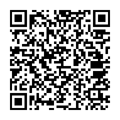

# fases - Ferass' Base System

*Simple coreutils for a fully functionnal UNIX-like system*

***Project Documentation***

(!) Please note that documentation is incomplete and can be very outdated (!)

- [Compile fases](docs/COMPILE.md)

- [Mirrors](docs/MIRRORS.md)

- [Status](docs/STATUS.md)

- [Coding Style](docs/CODING_STYLE.md)

- [Incomplete TODO list](docs/TODO.md)

- [FAQ](docs/FAQ.md)

- [Contributions](docs/CONTRIBUTE.md).

## Goal

The `fases` project tries to provide friendly, functionnal and simple core 
utilities for a fully functionnal UNIX-like Operating System. It tries to 
be entirely portable and working on any UNIX-like Operating System and kernel 
such as OpenBSD and Linux. It also tries to be completly modular and as such 
one utility should **not** depend on another in order to work. The coreutils 
are still a work-in-progress.
The `fases` utilities are currently tested on Artix, Alpine, OpenBSD, OS X and
FreeBSD. We expect all utilities to work on all systems implementing POSIX 
due to us using only POSIX-compliant functions.

## Directory structure

```
fases.git
  ├── box.c
  ├── box-templates
  │   ├── box_1-23.c
  │   ├── box_45-49.c
  │   ├── box_70-73.c
  │   └── box_94-96.c
  ├── config.mk
  ├── COPYING.3BSD
  ├── COPYING.FBDL
  ├── COPYING.GPLv3
  ├── core
  │   └── <core utilities>
  ├── docs
  │   └── <documentation>
  ├── extras
  │   └── <extra utilities>
  ├── Makefile
  ├── man
  │   └── <manpages>
  └── README.md
```

## Licensing

The `fases` project is licensed under 3 separate licenses:

- POSIX core utilities are licensed under the permissive 3-clause BSD license ;

- The documentation, including manpages, are licensed under the FreeBSD 
documentation license ;

- The "Work in progress" GIF is licensed under CC-BY-SA 4.0 ;

- Non-POSIX utilities such as box and extras are licensed under the copyleft 
GPLv3 license. The `fases` box binary is also licensed under the GPLv3.

## Chat

The `fases` project has 2 IRC channels hosted on 2 IRC Networks:

- `#fases` on `LibreIRC` ([webchat](https://kiwi.andrewyu.org/#fases)):

server: `irc.andrewyu.org` ;

ssl: `6697` (recommended) ;

plain: `6667`.

- `#fases` on `Libera.Chat` ([webchat](https://web.libera.chat/#fases)):

server: `irc.libera.chat` ;

ssl: `6697` (recommended) ;

plain: `6667`.

There's also an XMPP channel/room:

- `vitali64.duckdns.org`:

server: `[conference.]vitali64.duckdns.org` ;

room: `fases@conference.vitali64.duckdns.org`.

All those channels are bridged together so you can talk to us regardless of 
which chat platform you use.

## Mailing Lists

(!) The ***fases -at- andrewyu -dot- org*** mailing list is going to be 
deprecated soon in favor of the new 
***fases-general -at- andrewyu -dot- org*** which includes a new UI and 
a mail archive that isn't provided by a third-party. Please use that 
mailing list instead. (!)

The `fases` project also has a mailing list ran by Andrew Yu (thanks!).

The mailing list's address is: 
***fases-general -at- andrewyu -dot- org*** 
([subscribe](https://mail.andrewyu.org/mailman/listinfo/fases-general)). 

To send patches, please use `git-send-email`. A tutorial on how to use 
it can be found [here](https://git-send-email.io/).

See [docs/CONTRIBUTE.md](docs/CONTRIBUTE.md).

## Donations

Donations really help this project, no matter how small. People that work 
on this project are unpaid volunteers that do it on their freetime.
We currently only accept XMR/Monero. You can use these addresses for 
donating.

Project Donations: 
`
83bXvP25H5SX3kfTXMcjdm816KFUapPdN2eUV1gAF3JTNcoqNtG5ZxvfRUF81bZMMWXcX5kES1h1jCJCNyYZmrHGVeQBGNK
`


The server hosting the project also costs money. To keep the server up and 
running, you can donate to this address:

Server Donations: 
`
85q7XiHDpjYVq3cQ3uBSMN9JchP4mgpBGRc6SY9G6vyjF22QAugJxYAabLt9bQDvj3DcqkDjQKmduCNPVbzq7xVdTLmu2LF
`



You can also donate to other contributors separately. Thanks!

## Thank you!

I would like to thank a few people there, mainly:

- Andrew Yu, for making a mirror on their git server at git.andrewyu.org, and 
linking the ##fases libera.chat channel to LibreIRC, for testing fases on
OpenBSD and for hosting the mailing list.

- Leah Rowe, for adding lots of improvements on her 
[git repo](https://notabug.org/vimuser/fases) and for testing fases on OpenBSD.
[Donate](https://www.patreon.com/libreleah).

- Ron Nazarov, for fixing a weird bug in `yes` and adding useful features in 
it.

- Other people I forgot to add there. If I forgot to add you there, do send 
a patch or just tell me :D.

Contributions are very welcome, even if you're not a programmer. You can help 
this project by:

- Testing utilities and reporting bugs ;

- Talking about fases ;

- Donating XMR/Monero ;

- Giving me recommendations.

Help is greatly appreciated, thanks!


